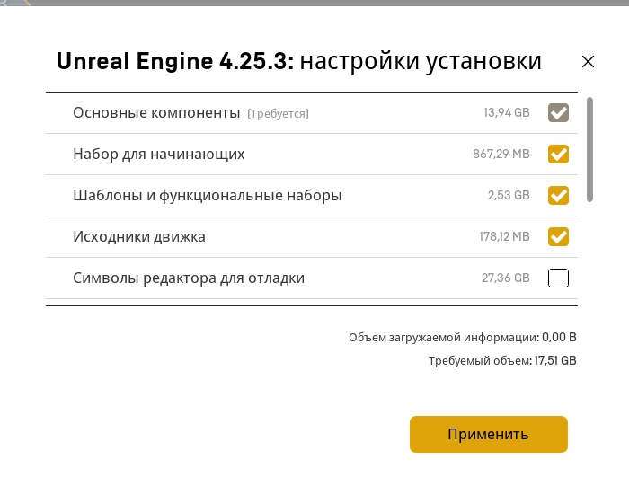

# Проект "Адаптация"
Данный проект был создан для знакомства с Unreal Engine 4 (на данный момент последняя версия движка - 4.25.3). Этот проект - отличная возможность поработать в команде и создать свою первую (или уже не первую) игру.
## Установка движка
---
Перед тем как начать работать, вам нужно установать среду, в которой вы будуте работать. [Вот ссылка на гайд по установке Unreal Engine](https://unreal-engine-4-russian.fandom.com/ru/wiki/%D0%97%D0%BD%D0%B0%D0%BA%D0%BE%D0%BC%D1%81%D1%82%D0%B2%D0%BE_%D1%81_Unreal_Engine_4_/_%D0%A3%D1%81%D1%82%D0%B0%D0%BD%D0%BE%D0%B2%D0%BA%D0%B0_Unreal_Engine_4),
сами настройки установки движка на скриншоте ниже:
​

Если вы планируете писать код на C++, а не использовать Blueprints Visual Scripting - систему визуального программирования, доступную в самом движке, то нужно будет поставить также Visual Studio. Гайд по установке [на английском](https://docs.unrealengine.com/en-US/Programming/Development/VisualStudioSetup/index.html), [на русском](https://uedocs.blogspot.com/2019/10/visual-studio-unreal-engine-4.html). Я использую Microsoft Visual Studio Community 2019, версия 16.3.7, но не думаю, что это принципиально. 
## Совместная работа
---
Предполагаю, что совместная работа будет вестись путём коммитов в один репозиторий на гитхаб, с последующим объединением веток. Также Unrea Engine поддерживает режим совместной разработки, но в нём я пока не разобрался, и вроде как это работает только для локальной сети. В общем, в этой части я не откажесь от вашей помощи.
[Вот ссылка на обучение работе с git и github на примере графического клиента TortoiseGit](https://github.com/nektonick/git-training/blob/master/MAIN.md)

## О Unreal Engine 4
---
На данный момент есть два самых популярных игровых движка: Unreal Engine и Unity. При должном опыте, хорошие игры можно делать и там и там. У Unreal Engine на данный момент более приятная лицензия, плюс неограниченный доступ к ассетам из [Quixel Megascans](https://quixel.com/megascans/). В Unreal Engine используется встроенная система визуального программирования и язык C++. В Unity основным языком является C#. 

В целом, используя готовый движок, вам не приходится с нуля писать физику, рендер, нужно лишь изучить, как использовать уже готовые функции. С другой стороны, при модификации стороннего движка возникает куда больше проблем, чем если бы вы меняли самописный движок. Впрочем, на начальном этапе это не важно. [Тык](https://qna.habr.com/q/191437), [тык](https://habr.com/ru/post/467175/).

## Что делать дальше?
--- 
* [Первые шаги - вращающийся банан (статья на хабре)](https://habr.com/ru/post/344394/)
* [Текущие задачи проекта](src/text/Текущие_задачи.md)
* [Сюжет игры](src/text/Сюжет.md)